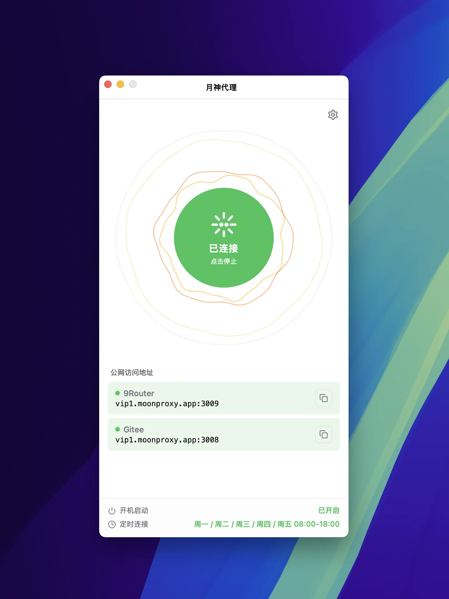

# 月神代理（MoonProxy）

> 跨平台、面向非技术用户的 **FRP 桌面客户端**。基于 [Tauri v2](https://tauri.app) 构建，支持 macOS 与 Windows，让 [frp](https://github.com/fatedier/frp) 内网穿透开箱即用。

[](./LICENSE)
[](https://github.com/MoonProxyHQ/moonproxy-desktop/stargazers)
[](https://github.com/MoonProxyHQ/moonproxy-desktop/forks)
[](https://github.com/MoonProxyHQ/moonproxy-desktop/releases)
[](https://github.com/MoonProxyHQ/moonproxy-desktop/actions/workflows/ci.yml)
[](https://github.com/MoonProxyHQ/moonproxy-desktop/actions/workflows/release.yml)
[](https://github.com/MoonProxyHQ/moonproxy-desktop/releases)
[](#下载)
[](https://github.com/fatedier/frp)
[](https://tauri.app)

<a href="https://github.com/MoonProxyHQ/moonproxy-desktop/releases/latest"></a>&nbsp;<a href="https://github.com/MoonProxyHQ/moonproxy-desktop/releases/latest"></a>&nbsp;<a href="https://github.com/MoonProxyHQ/moonproxy-desktop/stargazers"></a>

<br/>

<a href="https://github.com/MoonProxyHQ/moonproxy-desktop/releases/latest"></a>&nbsp;<a href="https://github.com/MoonProxyHQ/moonproxy-desktop/releases/latest"></a>&nbsp;<a href="https://github.com/MoonProxyHQ/moonproxy-desktop/releases/latest"></a>


[English](./README.en.md) · **简体中文**

---



面向非技术用户的 **[frp](https://github.com/fatedier/frp) 桌面 GUI 客户端**。
你只需要提供一台运行了 frps 的服务器（自建或社区公开均可），剩下的交给 MoonProxy：
配置生成、子进程生命周期、连接健康检查、实时流量监控、自动更新、托盘常驻等开箱即用。

不需要命令行、不需要编辑 `frpc.toml`、不需要手动管理 frpc 进程——
适合**个人开发者、自建服务玩家、远程办公者**以及所有不想和终端打交道的 frp 用户。

## 核心特性

### 🚀 上手：零配置，开箱即用

- **内置 frpc 二进制**：通过 Tauri sidecar 机制打包，用户无需单独安装 frp
- **可视化管理代理规则**：TCP / UDP / HTTP / HTTPS 一面板搞定，主页实时显示本地端口连通性
- **一键启停 frpc**：启动按钮分 4 态（已停止 / 连接中 / 已连接 / 连接错误），「已连接」由 frpc 自身证据支撑而非乐观标记

### ⚙️ 运行：稳定常驻，省心可靠

- **实时流量监控**：主页展示上下行速率曲线、连接数与累计流量，掌握带宽占用
- **端点健康轮询**：自适应间隔（3→24s 指数退避）探测本地端口可达性，提前发现隧道断裂
- **系统托盘常驻**：关闭窗口默认隐藏到托盘，frpc 继续后台运行
- **开机启动 + 静默启动**：自启时直接隐藏到托盘，不打扰用户
- **定时连接**：按星期多选 + 起止时间，调度器每分钟热加载

### 🔧 维护：自动升级，无需重装

- **核心引擎自更新**：从 frp 上游 GitHub Release 拉取 frpc，SHA256 校验后原子替换，无需重装应用
- **应用本体自更新**：基于 `tauri-plugin-updater` 的「重启并安装」


## 适用场景

- **远程办公**：在家通过 SSH / RDP 连接到公司内网机器，绕开 VPN 的繁琐
- **自建服务公网访问**：NAS、Home Assistant、家庭影音、个人博客的临时对外
- **开发联调**：本地端口临时暴露给 Webhook 回调、OAuth 回调、第三方联调
- **团队内部工具**：把本地服务临时共享给同事，无需公网 IP 或云服务器
- **游戏联机**：Minecraft 等联机服务临时对朋友开放

## 与 frp 的关系

[MoonProxy](https://github.com/MoonProxyHQ/moonproxy-desktop) 是 [fatedier/frp](https://github.com/fatedier/frp) 的**非官方**桌面 GUI 客户端，与 frp 项目相互独立。

- **frp** 是 fatedier 维护的开源反向代理 / 内网穿透项目（以下简称为「frp」）
- **MoonProxy** 不修改 frpc 行为，只做**配置生成、子进程生命周期管理、连接状态可视化**
- frpc 二进制（v0.69.1）通过 Tauri sidecar 机制打包，无需用户单独安装
- frpc 引擎可由应用内自动从 frp 上游 Release 拉取并原子升级

> 简言之：**frp 提供「能力」，MoonProxy 提供「易用性」。**

## 常见问题

### 月神代理是什么？

月神代理（英文名 **MoonProxy**）是一款跨平台 **FRP（Fast Reverse Proxy）内网穿透桌面客户端**，基于 [Tauri v2](https://tauri.app) 打造，面向非技术用户。
它把 frpc 命令行的复杂度——配置文件、进程管理、健康检查——封装为图形化界面。

### 支持哪些平台？

macOS（Apple Silicon `aarch64` 与 Intel `x64`）和 Windows（`x64`）。安装包发布在 [GitHub Releases](https://github.com/MoonProxyHQ/moonproxy-desktop/releases)，提供 DMG（macOS）与 EXE（Windows）两种格式。

### 需要自己安装 frp 吗？

不需要。月神代理通过 [Tauri sidecar 机制](https://tauri.app) 内置了 frpc 二进制（当前 v0.69.1），开箱即用。

### 是开源的吗？

是的。月神代理以 MIT 协议开源，源代码与发布节奏在 GitHub 仓库 `MoonProxyHQ/moonproxy-desktop` 公开。

### 与直接用 frp 命令行相比，多了什么？

可视化管理代理规则、4 态启动按钮、实时流量监控（上下行速率曲线 + 连接数 + 累计流量）、端点健康轮询（自适应间隔探测本地端口可达性）、系统托盘常驻、开机启动与静默启动、定时连接（按星期与起止时间）、从上游 GitHub Release 自动更新 frpc 引擎（SHA256 校验后原子替换），以及应用本体自更新。

### 我没有 frps 服务器，能用吗？

月神代理只管理 frpc 客户端侧，需要你自备 frps 服务端。常见方案：① 自建一台有公网 IP 的机器（云厂商 1 核 2G 即可）；② 使用社区公开的 frps 节点（请自行评估可信度与安全性）；③ 在云函数（Serverless）上部署轻量 frps。Discussions 区有用户分享的部署教程。

### 通过月神代理暴露内网服务，数据安全吗？

数据安全由 frp 协议本身保障：通信使用 TCP/TLS 或 KCP 加密，认证 Token 由你掌握。月神代理本身不存储、不中转你的业务数据，配置文件和 Token 仅保存在本机。
安全实践建议：① 为每个代理规则设置不同的强 Token；② 启用 frpc 的 TLS 加密（`frpc.toml` 中 `transport.tls.force = true`）；③ frps 服务端开启鉴权白名单（`allowUsers`）；④ 公网侧配合防火墙仅暴露必要端口。

### 月神代理和 ZeroTier / Tailscale 有什么区别？

二者场景不同：ZeroTier / Tailscale 属于全设备组网 VPN，把所有流量纳入虚拟局域网；frp（月神代理管理的协议）属于按需反向代理，仅把指定本地端口一对一暴露到公网。
想远程桌面/SSH 到家里所有机器 → 选 ZeroTier/Tailscale；只想把家里的 NAS、博客、Webhook 回调临时对外 → 选 frp + 月神代理。两者可共存。

## 关键词

FRP 内网穿透 · frpc · frps · 反向代理 · NAT 穿透 · 内网穿透桌面客户端 · Tauri v2 · Rust · Vue 3 · TypeScript · macOS · Windows · Apple Silicon · 跨平台桌面应用 · MIT 开源 · 月神代理 · MoonProxy · MoonProxyHQ

## 下载

预构建包发布在 [GitHub Releases](https://github.com/MoonProxyHQ/moonproxy-desktop/releases)。

| 平台 | 文件 |
| --- | --- |
| macOS (Apple Silicon) | `MoonProxy_<version>_aarch64.dmg` |
| macOS (Intel) | `MoonProxy_<version>_x64.dmg` |
| Windows (x64) | `MoonProxy_<version>_x64-setup.exe` |

> **macOS 首次打开提示**：本应用为 ad-hoc 签名，**未做 Apple 公证**（无 Apple Developer 证书）。
> 首次打开请右键点击应用 → **打开** → 在弹出对话框中点 **打开**；
> 或将应用拖入 `/Applications` 后执行 `xattr -cr "/Applications/月神代理.app"`
> 去掉隔离属性。Intel Mac 可直接双击运行。

## 从源码构建

```bash
pnpm install
pnpm sync:frpc        # 下载 frpc 二进制
pnpm tauri dev        # 本地开发联调
pnpm tauri build      # 当前平台打包
```

> 依赖：Node.js、pnpm、Rust 工具链、各平台构建工具链。详见 [CONTRIBUTING.md](./CONTRIBUTING.md)。

## 资源与链接

| 资源 | 链接 |
| --- | --- |
| 🌐 官方主页 | <https://moonproxy.app> |
| 📦 下载安装包 | [GitHub Releases](https://github.com/MoonProxyHQ/moonproxy-desktop/releases) |
| 📖 贡献指南 | [CONTRIBUTING.md](./CONTRIBUTING.md) |
| 💬 问题反馈与讨论 | [GitHub Issues](https://github.com/MoonProxyHQ/moonproxy-desktop/issues) · [Discussions](https://github.com/MoonProxyHQ/moonproxy-desktop/discussions) |
| 🛠 开发协作文档 | [AGENTS.md](./AGENTS.md) |

## 相关项目

以下是与 MoonProxy 同属 FRP / 内网穿透生态的项目，按"互补 vs 同类"分组：

### 同类 FRP GUI 客户端

- [luckjiawei/frpc-desktop](https://github.com/luckjiawei/frpc-desktop) — 跨平台 FRP 桌面客户端（Flutter），同样定位
- [koho/frpmgr](https://github.com/koho/frpmgr) — Windows 平台 FRP 管理器（C#）
- [codemonkey-m/FrpClient-Win](https://github.com/codemonkey-m/FrpClient-Win) — frpc Windows GUI 客户端
- [hidumou/frpc-gui](https://github.com/hidumou/frpc-gui) — 现代化跨平台 frpc GUI
- [3035936740/FRP-Client-GUI](https://github.com/3035936740/FRP-Client-GUI) — Python 管道调用 frpc 的轻量 GUI
- [f-shake/FrpGUI](https://github.com/f-shake/FrpGUI) — Avalonia 开发的跨平台 FRP GUI（Windows/Linux/macOS）
- [Skyxmao/EasyFrp](https://github.com/Skyxmao/EasyFrp) — 跨平台图形化 FRP 客户端（Win/Mac/Linux）
- [LakeYang/frp-GUI](https://github.com/LakeYang/frp-GUI) — Windows 平台 frp GUI 客户端
- [Cydmi/frp-gui](https://github.com/Cydmi/frp-gui) — macOS 平台 frp GUI 客户端
- [jiupamiao/FRPC_GUI_Chinese](https://github.com/jiupamiao/FRPC_GUI_Chinese) — 可高度自定义的中文 FRPC GUI 生成工具
- [jlucaso1/frpc_gui_flutter](https://github.com/jlucaso1/frpc_gui_flutter) — 基于 Flutter 的 FRPC GUI
- [marvinli001/frpc-gui-client](https://github.com/marvinli001/frpc-gui-client) — 一键式 FRP 内网穿透客户端（Electron），多源服务器列表

### FRP 生态互补工具

- [fatedier/frp](https://github.com/fatedier/frp) — FRP 协议本体（MoonProxy 的引擎）
- [VaalaCat/frp-panel](https://github.com/VaalaCat/frp-panel) — 多节点 frp web 管理面板
- [AceDroidX/frp-Android](https://github.com/AceDroidX/frp-Android) — Android 平台 frp 客户端

### 替代方案对比

- [anderspitman/awesome-tunneling](https://github.com/anderspitman/awesome-tunneling) — Ngrok / Cloudflare Tunnel / Tailscale 等替代方案大全

## 许可证

[MIT](./LICENSE)。

---

## ⭐ 支持这个项目

如果 MoonProxy 帮到了你，请考虑给一个 **[Star](https://github.com/MoonProxyHQ/moonproxy-desktop/stargazers)** ⭐

你的 Star 是这个项目持续维护和改进的唯一动力。每一颗星都让更多需要 FRP 图形化客户端的人能找到它。

- 发现了 Bug？[提 Issue](https://github.com/MoonProxyHQ/moonproxy-desktop/issues)
- 有想法或问题？[来 Discussions](https://github.com/MoonProxyHQ/moonproxy-desktop/discussions)
- 想贡献代码？[阅读贡献指南](./CONTRIBUTING.md)

---

> 本项目与 [fatedier/frp](https://github.com/fatedier/frp) 项目相互独立，
> frp 的发布与许可归原项目所有；MoonProxy 仅作为其桌面客户端。
